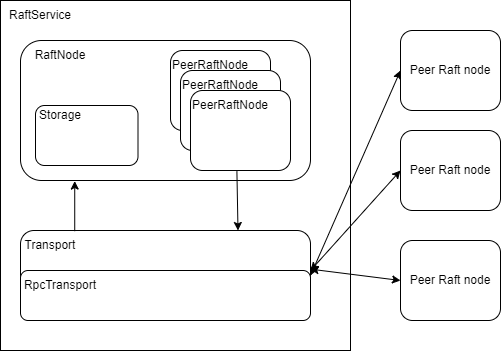

# raft
implement [Raft Consensus protocol](https://raft.github.io)

# Design


# Example

```bash
go get github.com/ISSuh/raft
```

```go

import github.com/ISSuh/lsm-tree/raft

// raft service active on background
service := raft.NewRaftService(id, address)
service.RegistTrasnporter(raft.NewRpcTransporter())
service.Run()

...

// coonect peer each other
peers := map[int]string {
  100: "192.168.50.1:11423",
  200: "192.168.50.200:7754"
}

service.ConnectToPeers(peers)

...

// add entries to node
go func() {
  item := make([][]byte, 0)
  for i := 0 ; i < 10 ; i++ {
    item = append(item, []byte(strconv.Itoa(i)))
  }

  service.ApplyEntries(item)
}()

...

// raft service stop
service.Stop()

```

#ToDo
* unittest
* redesign async handler(onRequestVote, onAppendEntries) like event queue when received request from peer node
* implement log save & restore using persistence storage
